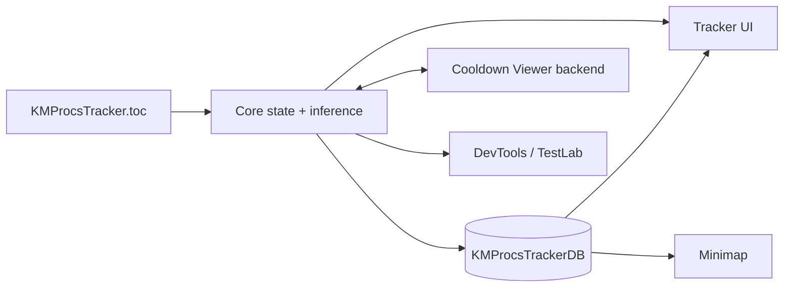

# Code graph

```mermaid
flowchart LR
  TOC["KMProcsTracker.toc"] --> Core["Core state + inference"]
  Core --> DB[("KMProcsTrackerDB")]
  Core <--> CDM["Cooldown Viewer backend"]
  Core --> UI["Tracker UI"]
  DB --> UI
  DB --> Mini["Minimap"]
  Core --> Dev["DevTools / TestLab"]
```
