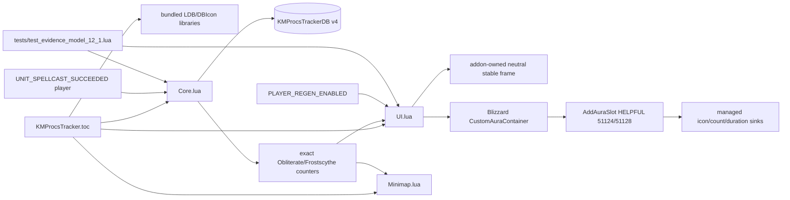

# KM Procs Tracker code graph

The graph has no raw aura, combat-log, SpellActivationOverlay, action-button-glow, Cooldown Viewer, child-frame-scan, ticker, or simulated-stack path. Proc/use/expired/overcap/stacks are represented as unavailable, not inferred.
