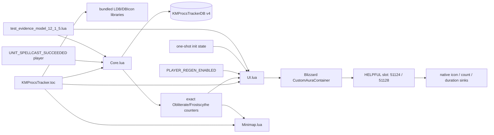

# KM Procs Tracker code graph

```mermaid
flowchart LR
  T["KMProcsTracker.toc"] --> L["bundled LDB/DBIcon libraries"]
  T --> C["Core.lua"]
  T --> U["UI.lua"]
  T --> M["Minimap.lua"]
  C --> DB[("KMProcsTrackerDB v4")]
  E["UNIT_SPELLCAST_SUCCEEDED player"] --> C
  C --> X["exact Obliterate/Frostscythe counters"]
  X --> U
  X --> M
  U --> A["Blizzard CustomAuraContainer"]
  A --> S["HELPFUL slot: 51124 / 51128"]
  S --> D["native icon / count / duration sinks"]
  R["PLAYER_REGEN_ENABLED"] --> U
  F["one-shot init state"] --> U
  Z["test_evidence_model_12_1_5.lua"] --> C
  Z --> U
```

`proc/use/expired/overcap/stacks` terminate at the explicit `unavailable` boundary. No inferred state path exists.
