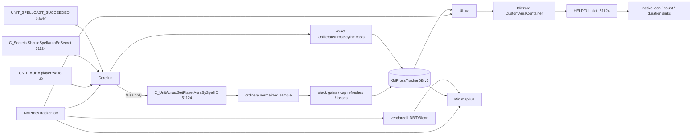

# KM Procs Tracker code graph

```mermaid
flowchart LR
  T["KMProcsTracker.toc"] --> C["Core.lua"]
  T --> U["UI.lua"]
  T --> M["Minimap.lua"]
  T --> L["vendored LDB/DBIcon"]

  UA["UNIT_AURA player wake-up"] --> C
  CS["C_Secrets.ShouldSpellAuraBeSecret 51124"] --> C
  C -->|false only| AU["C_UnitAuras.GetPlayerAuraBySpellID 51124"]
  AU --> N["ordinary normalized sample"]
  N --> O["stack gains / cap refreshes / losses"]
  O --> DB[("KMProcsTrackerDB v5")]

  SC["UNIT_SPELLCAST_SUCCEEDED player"] --> C
  C --> X["exact Obliterate/Frostscythe casts"]
  X --> DB

  U --> A["Blizzard CustomAuraContainer"]
  A --> S["HELPFUL slot: 51124"]
  S --> D["native icon / count / duration sinks"]

  DB --> U
  DB --> M
  L --> M
```

A restricted/inaccessible predicate terminates the raw path at managed display and clears the comparison baseline. Hidden intervals are never reconstructed.
